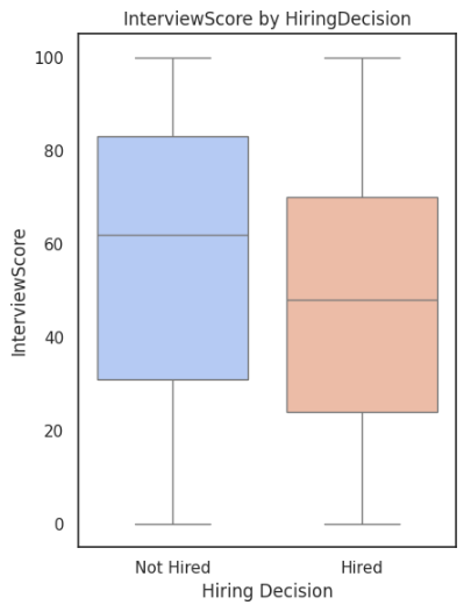
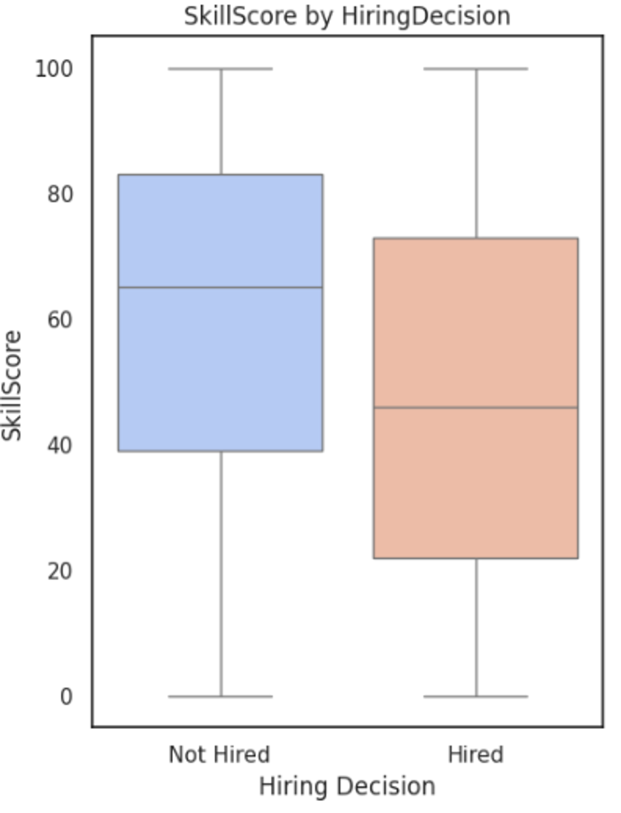
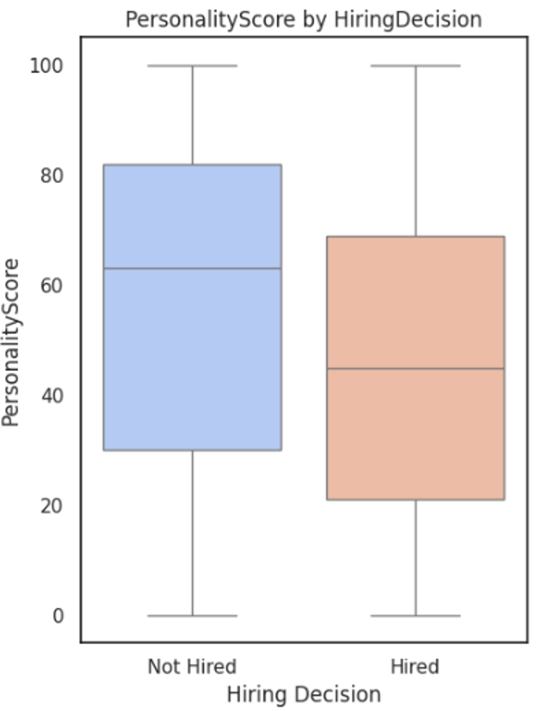
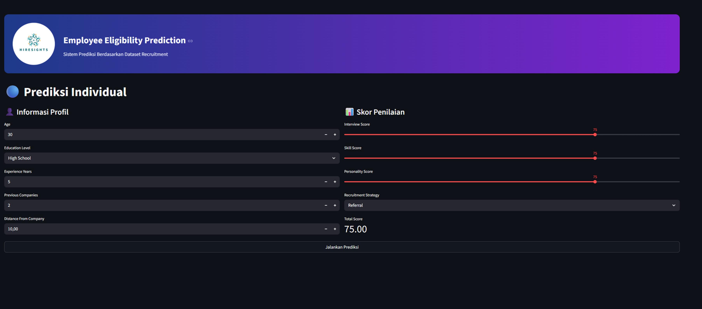
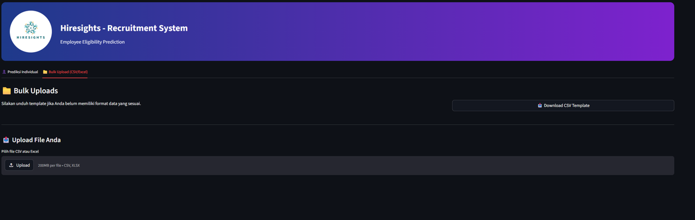

# HIRESIGHTS – Data-Driven Recruitment System

Optimizing Biased Talent Acquisition Through Data-Driven HR Analytics

---

## 📑 Final Presentation

📥 [Download Presentation](./Final%20Presentation.pptx)

---

# 📌 Project Overview

HIRESIGHTS is a machine learning-based recruitment system designed to optimize hiring decisions using HR analytics and predictive modeling.

This project transforms traditional recruitment processes into objective and data-driven decision-making systems through:
- Predictive analytics
- Automated candidate screening
- Fairness & bias analysis
- HR analytics dashboard

---

# 🎯 Business Problem

Traditional recruitment systems often face several major challenges:

- Subjective hiring bias
- High recruitment costs
- Poor hiring decisions
- Low scalability in candidate screening

According to Harvard Business Review:
- 80% employee turnover is caused by poor hiring decisions
- A bad hire can cost up to 200% of an employee’s annual salary

---

# 🧠 CRISP-DM Workflow

| Stage | Description |
|---|---|
| Stage 0 | Business Understanding |
| Stage 1 | Data Understanding |
| Stage 2 | Data Preparation |
| Stage 3 | Modeling |
| Stage 4 | Evaluation & Deployment |

---

# 📊 Dataset Information

| Information | Value |
|---|---|
| Total Rows | 1,500 |
| Total Features | 11 |
| Numerical Features | 7 |
| Categorical Features | 3 |
| Target Variable | HiringDecision |

---

# 🧹 Data Preprocessing

## 🔹 Feature Scaling
- StandardScaler

## 🔹 Feature Encoding
- One Hot Encoding
- Ordinal Encoding

## 🔹 Data Balancing
- SMOTE (Synthetic Minority Oversampling Technique)

SMOTE is used to solve imbalanced dataset problems by generating synthetic minority class samples.

---

# 🤖 Machine Learning Models

| Model | F1-Score | ROC-AUC |
|---|---|---|
| Logistic Regression | 72.3% | 88.6% |
| Random Forest | 81.6% | 91.0% |
| XGBoost | 84.7% | 91.3% |
| Decision Tree | 70.1% | 80.1% |
| K-Nearest Neighbors | 45.3% | 62.5% |

---

# 🏆 Best Model – XGBoost

| Metric | Score |
|---|---|
| Accuracy | 91.3% |
| Precision | 85.7% |
| Recall | 83.7% |
| F1-Score | 84.7% |
| ROC-AUC | 91.3% |

---

# 📊 Insight Visualization

## 🔹 Feature Importance

Feature importance analysis shows that recruitment strategy and candidate qualification scores strongly influence hiring decisions.

---

## 🔹 Confusion Matrix

The XGBoost model successfully classified most candidate data with minimal prediction errors.

---

## 🔹 Interview Score Analysis

---

## 🔹 Skill Score Analysis

---

## 🔹 Personality Score Analysis

---

## 🔹 Education Level Analysis

Higher education levels significantly increase hiring probability.

---

## 🔹 Experience Level Analysis

Senior-level candidates have a much higher hiring rate compared to junior candidates.

---

## 🔹 Recruitment Strategy Analysis

Internal recruitment strategy demonstrates the highest hiring success rate.

---

# ⚖️ Fairness & Bias Analysis

Key findings:
- Internal recruitment strategy strongly affects hiring prediction
- Higher education level increases hiring probability
- Age and demographic variables have minimal impact
- Bias evaluation was conducted to improve fairness in recruitment decisions

---

# 💰 Business Impact

| Scenario | Total Cost |
|---|---|
| Without Model | Rp 4.950.000.000 |
| With Model | Rp 1.386.000.000 |

## 📈 Results
- Cost Saving: **Rp 3.564 Billion**
- Efficiency Improvement: **72%**

---

# 📈 Dashboard Preview

 

---

# 🛠 Technologies Used

- Python
- Pandas
- NumPy
- Scikit-learn
- XGBoost
- SMOTE
- Streamlit
- Matplotlib

---

# 🚀 Key Features

- Automated Candidate Screening
- HR Analytics Dashboard
- Predictive Recruitment Modeling
- Fairness & Bias Analysis
- Cost Efficiency Analysis
- Real-Time Candidate Prediction

---

# 👨‍💻 Author

### Fadli Nurrizky

---

# 🙏 Thank You
